# DePay

DePay is a crypto payment gateway prototype built as a multi-module Go monorepo with PostgreSQL as the source of truth and a React/Vite web UI for demo, analytics and administration.

The coursework scope is complete. The next development track turns the same codebase into a portfolio-ready, production-like pet project without rewriting the existing services.

## Overview

DePay models the core pieces of a crypto checkout platform:

- users, merchants, wallets and balances;
- invoices, NFC-style payment sessions and payment transactions;
- KYC, risk alerts and audit logs;
- merchant webhook registration and delivery logs;
- SQL analytics and an admin/demo web UI;
- optional Kong, Vault, Prometheus/Grafana and Kubernetes manifests for production-like practice.

The stable local demo path is Docker Compose + PostgreSQL + backend Go services + React web.

## Features

- PostgreSQL schema with normalized tables, indexes, enum types, views, roles and grants.
- Ordered migrations and seeded coursework/demo data.
- 12 SQL functions for reporting and analytics.
- PostgreSQL triggers for ownership checks, negative balance protection, balance history, transaction lifecycle, audit logging and risk alerts.
- Go services for user, merchant, wallet, transaction core, transaction validation, gas info, KYC and admin APIs.
- Admin web UI for table browsing, SQL function execution, analytics charts and an end-to-end demo payment flow.
- Mock/dev provider defaults with env-based switches for blockchain RPC, wallet balance RPC, gas provider, KYC provider and webhook HTTP delivery.
- Security paths for JWT refresh rotation/logout, production demo gating and merchant API keys.
- Optional local Kong gateway, Vault dev mode, Prometheus/Grafana and Kubernetes validation.

## Architecture

The repository keeps top-level service directories. Each backend service has its own `go.mod` and imports common packages from `shared` through `replace shared => ../shared`.

```mermaid
flowchart LR
  Web["React/Vite Web"] --> Admin["admin-service"]
  Web --> Kong["Kong Gateway (optional)"]

  Kong --> User["user-service"]
  Kong --> Merchant["merchant-service"]
  Kong --> Wallet["wallet-service"]
  Kong --> TxCore["transaction-core-service"]
  Kong --> TxValidation["transaction-validation-service"]
  Kong --> Gas["gas-info-service"]
  Kong --> KYC["kyc-service"]

  User --> PG[("PostgreSQL")]
  Merchant --> PG
  Wallet --> PG
  TxCore --> PG
  TxValidation --> PG
  Admin --> PG

  Wallet --> Redis[("Redis cache")]
  Gas --> Redis
  TxCore --> Rabbit[("RabbitMQ optional")]
  TxCore --> Chain["EVM JSON-RPC or mock"]
  Wallet --> BalanceRPC["Balance RPC or mock"]
  Gas --> GasProvider["HTTP gas provider or mock"]
  KYC --> KYCProvider["HTTP KYC provider or mock"]
  TxCore --> MerchantWebhook["Merchant webhook endpoint"]

  Prom["Prometheus"] --> User
  Prom --> Merchant
  Prom --> Wallet
  Prom --> TxCore
  Prom --> Admin
  Grafana["Grafana"] --> Prom
```



More detail: [docs/architecture.md](docs/architecture.md).

## Tech Stack

- Backend: Go, Gin, PostgreSQL repositories, in-memory fallbacks for focused local/test paths.
- Shared backend packages: config, logging, middleware, auth, db, errors, events, observability and validation.
- Database: PostgreSQL, `golang-migrate`, SQL seed data and SQL smoke tests.
- Cache and async support: Redis and RabbitMQ.
- Frontend: React, Vite, TypeScript, TanStack Query, Recharts and Vitest.
- Local infrastructure: Docker Compose profiles.
- Production-like layer: Kong, Vault dev mode, Prometheus/Grafana and Kubernetes manifests.

## Screenshots

Capture checklist: [docs/screenshots.md](docs/screenshots.md).

Portfolio-relevant screens:

- architecture diagram;
- database ERD;
- admin tables and SQL function runner;
- analytics dashboard;
- login/persona selector;
- user dashboard, profile, KYC, wallets and transactions;
- merchant dashboard, invoices, webhooks, terminals and analytics;
- compliance KYC, merchant verification, risk and blacklist queues;
- admin system health;
- demo payment flow before/after confirmation;
- webhook delivery status table/view;
- Prometheus/Grafana overview dashboard and `/metrics` business gauges.

## Demo Flow

1. Start the stack with `make dev-ready && make web-up`.
2. Open `http://localhost:5173/admin/tables` and inspect seeded tables/views.
3. Open `/admin/functions` and run SQL functions such as `get_store_turnover`.
4. Open `/admin/analytics` and show turnover, status, failed transaction and RPC latency charts.
5. Open `/admin/demo`.
6. Click `Create` to create a demo invoice.
7. Click `Submit` to create and progress a payment to `confirmed`.
8. Check `payment_transactions`, `payment_invoices`, `audit_logs`, `merchant_webhook_deliveries` and `vw_webhook_delivery_status`.

## Quick Start

For a normal local run:

```bash
make dev-ready
make web-up
```

Open:

```text
http://localhost:5173/merchant/dashboard
http://localhost:5173/merchant/invoices
http://localhost:5173/merchant/webhooks
http://localhost:5173/merchant/terminals
http://localhost:5173/merchant/analytics
http://localhost:5173/user/dashboard
http://localhost:5173/compliance/kyc
http://localhost:5173/admin/system-health
http://localhost:5173/admin/tables
http://localhost:5173/admin/functions
http://localhost:5173/admin/analytics
http://localhost:5173/admin/demo
```

For a full project-local reset that removes Compose volumes:

```bash
make reset-local-data
make dev-ready
make web-up
```

`docker volume prune` may not remove Compose named volumes such as `depay-server_pgdata`, so `make reset-local-data` is the reproducible reset command for this repository.

## Services

| Component | Local port | Notes |
| --- | ---: | --- |
| `user-service` | `8080` | User registration, login, profile and KYC status APIs |
| `transaction-validation-service` | `8081` | Stateless validation by default, PostgreSQL-backed checks when configured |
| `gas-info-service` | `8082` | Mock or HTTP gas provider with optional Redis cache/history |
| `merchant-service` | `8083` | Merchant auth, verification, invoices, terminals and webhooks |
| `wallet-service` | `8084` | Wallets, balances, Redis cache and optional EVM balance sync |
| `transaction-core-service` | `8085` | Payment lifecycle, broadcast/mock broadcast and webhook delivery logging |
| `kyc-service` | `8086` | Mock or HTTP KYC provider |
| `admin-service` | `8090` | Admin tables, SQL function execution, analytics and demo flow |
| `apps/web` | `5173` | React/Vite admin/demo web UI |

Every Go service exposes `/health` and Prometheus-compatible `/metrics`.

## Database

Database assets live under `database/`:

- `database/migrations` contains ordered `golang-migrate` migrations;
- `database/seeds/seed_coursework.sql` seeds a complete local demo dataset;
- `database/tests/test_functions.sql`, `test_triggers.sql` and `test_webhooks.sql` provide SQL smoke/acceptance checks.

The migration order is extensions, enum types, tables, indexes, triggers, functions/views and roles/grants.

## API

Human-readable API summary: [docs/api.md](docs/api.md).

Machine-readable OpenAPI contract: [docs/openAPI.yaml](docs/openAPI.yaml).

New public/backend endpoints should use the `/api` prefix. Some legacy routes remain for compatibility and are not the preferred contract for new work.

## Testing

Run the portfolio baseline:

```bash
make reset-local-data
make dev-ready
make web-up
make sql-test
make test-go
make web-test
make web-build
```

For a faster check on an already prepared local database:

```bash
make sql-test
make test-go
make web-test
make web-build
```

Production-like image mode:

```bash
make docker-build
make image-up
```

Optional Kubernetes manifest validation:

```bash
make kind-up
make k8s-validate
```

This validates manifests with `kubectl apply --dry-run=server`. It does not prove runtime Kubernetes deployment until real service images and secrets are supplied.

## Production-Like Features

- Kong declarative routing in `kong/kong.yml` and `k8s/kong.yaml`.
- Vault dev-mode bootstrap in `server-config/setup_vault_and_kong.sh` and `k8s/vault.yaml`.
- Prometheus/Grafana configuration under `observability/`.
- Kubernetes manifests under `k8s/`.
- Provider switches through `.env.example` for blockchain RPC, wallet balances, gas, KYC and webhook delivery.

## Roadmap

The next development plan is tracked in `depay_next_dev_pack/`:

1. Post-coursework cleanup and portfolio packaging.
2. Product dashboards for user, merchant, compliance and admin roles. First product-console slice is available in `apps/web`.
3. Transaction lifecycle v2 with centralized state machine, idempotency and event outbox. State-machine/idempotency, invoice paid side effect and terminal webhook delivery coverage are implemented in `transaction-core-service`.
4. Production-like webhooks with signatures, retry/backoff and dead-letter status. The first slice adds signed delivery headers, retry scheduling, dead-letter status, merchant webhook detail/test endpoints and dashboard delivery previews.
5. Observability with request IDs, structured logs, business metrics and dashboards. Request IDs, HTTP logs and admin-service business metrics are implemented.
6. Dockerfiles, image-based local flow, CI and Kubernetes runtime readiness. Service/web Dockerfiles, image compose targets and GitHub Actions jobs are present.
7. Real provider adapters and integration tests remain the main future expansion path.

## Security Notes

- `JWT_SECRET` is read from the environment; do not use the local example value outside development.
- Mock/dev providers are the default local mode.
- DePay does not store private keys, seed phrases or raw wallet secrets.
- Refresh tokens and merchant API keys are stored only as hashes.
- Demo endpoints are blocked when `APP_ENV=production` unless explicitly enabled.
- Vault currently runs in dev mode for local experimentation.
- Kubernetes manifests are portfolio/validation assets until real images and production-grade secrets are provided.
- Admin/demo endpoints are intended for local coursework and portfolio flows, not a public production surface.

## Limitations

- This repository is not a production payment processor.
- Blockchain, KYC, gas and balance providers default to mock/dev behavior.
- Webhook retry/dead-letter status is modeled and scheduled; a background retry worker is still future work.
- RabbitMQ is optional in tests/local paths and is not yet a complete event-driven backbone.
- Kubernetes runtime deployment still needs image push/load workflow and real secret management.

## Documentation

- Architecture: [docs/architecture.md](docs/architecture.md)
- Coursework guide: [docs/coursework/README.md](docs/coursework/README.md)
- API summary: [docs/api.md](docs/api.md)
- OpenAPI contract: [docs/openAPI.yaml](docs/openAPI.yaml)
- Security notes: [docs/security.md](docs/security.md)
- Observability: [docs/observability.md](docs/observability.md)
- DevOps: [docs/devops.md](docs/devops.md)
- GitHub workflow: [docs/github-workflow.md](docs/github-workflow.md)
- Testing and quality: [docs/testing.md](docs/testing.md)
- Webhooks: [docs/webhooks.md](docs/webhooks.md)
- Defense script: [docs/defense-demo-script.md](docs/defense-demo-script.md)
- Screenshot checklist: [docs/screenshots.md](docs/screenshots.md)
- Implementation report: [IMPLEMENTATION_REPORT.md](IMPLEMENTATION_REPORT.md)
- Latest verification notes: [verification-results.md](verification-results.md)
