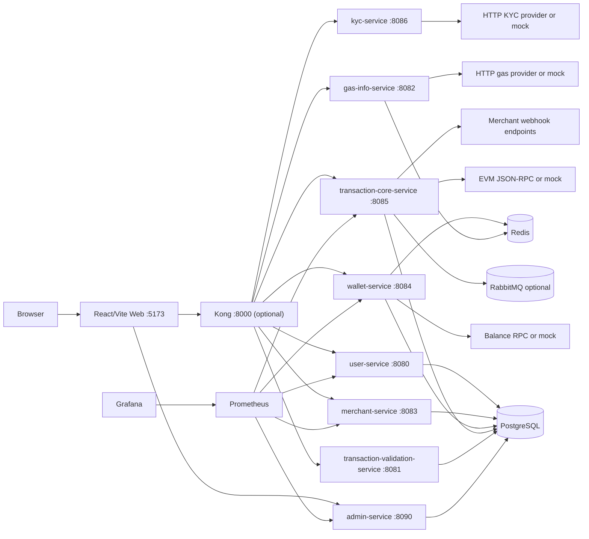
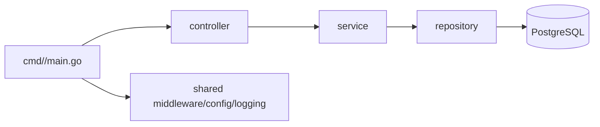
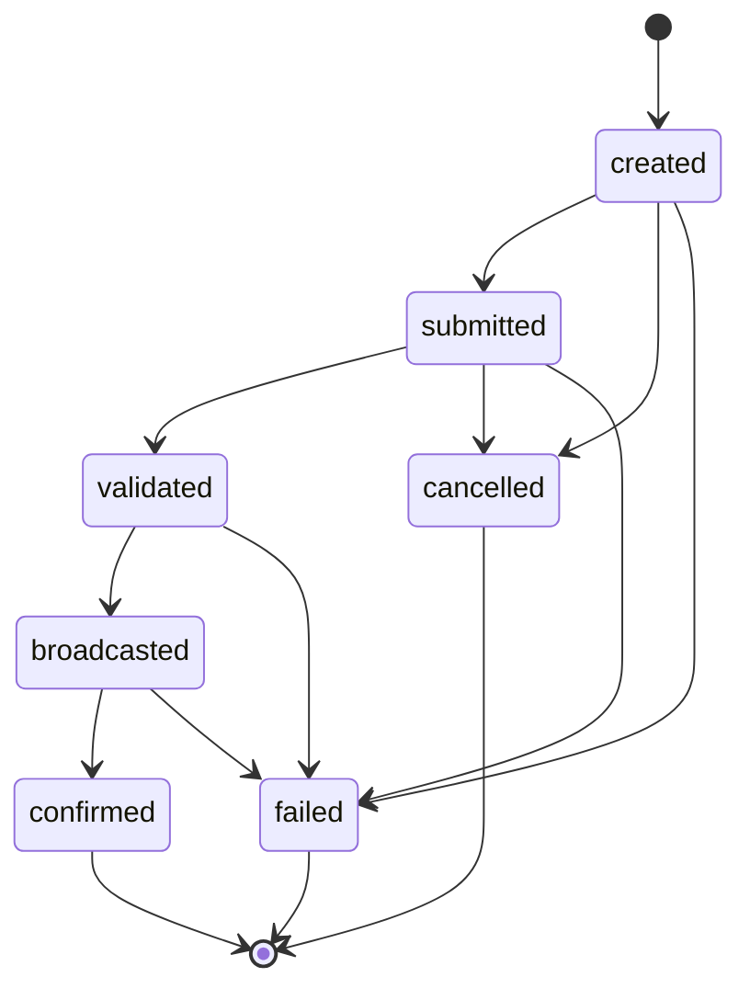

# DePay Architecture

This document describes the current architecture that the portfolio roadmap builds on. The repository is intentionally kept as a top-level multi-module Go monorepo rather than being moved into a `services/` directory.

## Runtime View

## Service Shape

Most Go services follow the same shape:

Where a repository exists, PostgreSQL is the production-like source of truth. Some services keep in-memory repositories as local or test fallbacks when `DATABASE_URL` is not available.

## Payment Lifecycle

The current persisted transaction flow is:

The PostgreSQL trigger is a safety guard for persisted status transitions. The next roadmap phase moves more lifecycle policy into a centralized transaction-core state machine with idempotency and event creation.

## Data Ownership

PostgreSQL owns durable state:

- users, merchants, verification and KYC;
- wallets, assets and balances;
- invoices, payment sessions and transactions;
- webhook registrations and delivery attempts;
- RPC nodes, audit logs and risk alerts;
- SQL views and reporting functions.

Redis is used as cache/history support for gas and wallet paths. RabbitMQ is optional and should remain disabled in focused tests through `SKIP_RABBITMQ=true`.

## Provider Modes

Local development defaults to safe mock/dev behavior:

| Area | Default | Real/provider switch |
| --- | --- | --- |
| Blockchain broadcast | Mock transaction hash | `BLOCKCHAIN_RPC_URL` |
| Wallet balance sync | Deterministic mock balance | `WALLET_BALANCE_RPC_URL` or `BLOCKCHAIN_RPC_URL` |
| Gas info | Mock gas data | `GAS_PROVIDER_URL` |
| KYC | Fast mock provider | `KYC_PROVIDER_URL`, `KYC_PROVIDER_API_KEY` |
| Webhook delivery | PostgreSQL log mode | `WEBHOOK_DELIVERY_MODE=http` |

No user private keys are stored by the demo.

## Local Profiles

Docker Compose profiles group optional layers:

| Command | Purpose |
| --- | --- |
| `make up` | PostgreSQL, Redis and RabbitMQ |
| `make backend-up` | Go backend services |
| `make web-up` | Backend plus React/Vite web |
| `make gateway-up` | Kong gateway |
| `make observability-up` | Prometheus and Grafana |
| `make secrets-up` | Vault dev mode |
| `make prod-like-up` | Backend, web, gateway, observability and secrets |

The baseline green-state is documented in the root README and in `depay_next_dev_pack/README.md`.
